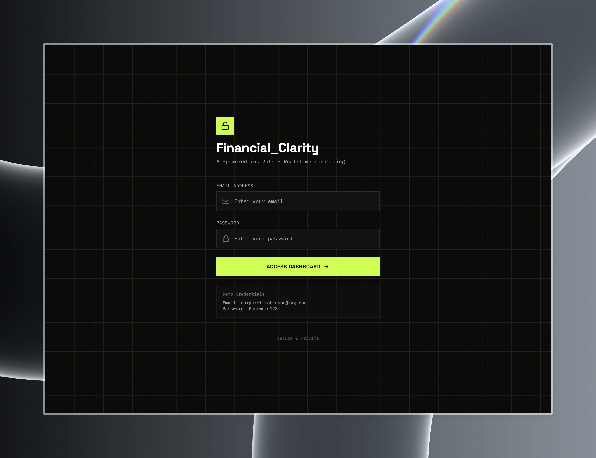
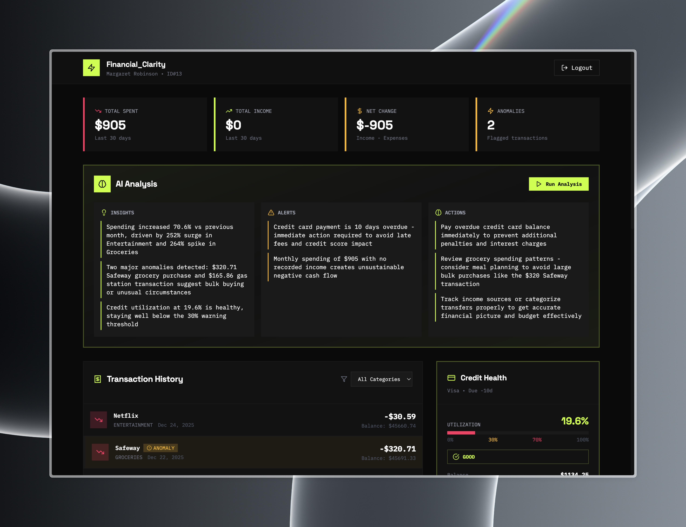
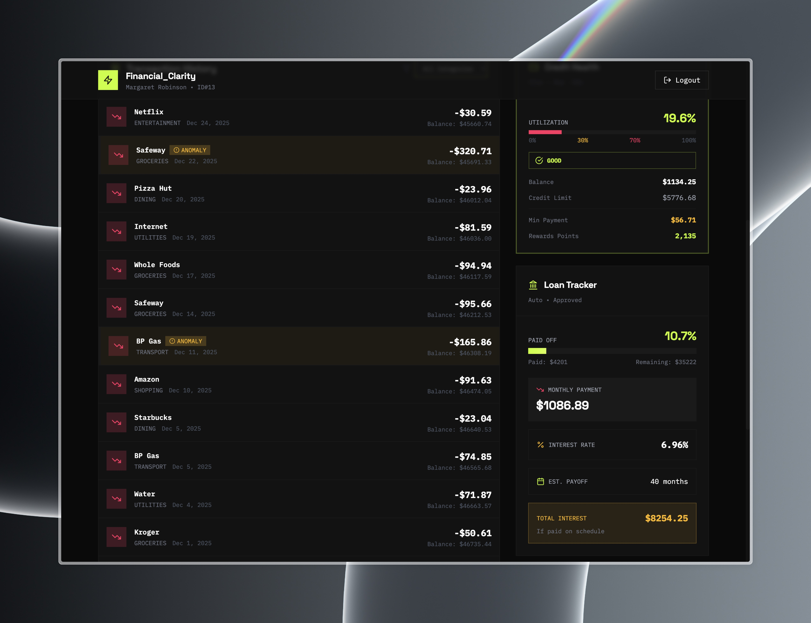

# Cap-One Tech Summit Personal Finance Agent

> This project was developed for the Cap-One Tech Summit Fellowship. It is an intelligent financial dashboard that leverages autonomous AI agents to provide real-time insights, detect anomalies, and optimize your financial health.


---

<p align="center">
  
  
  
</p>

---

## 🎯 Overview

The AI-Powered Personal Finance Advisor is a full-stack web application that combines modern financial management with cutting-edge AI technology. Built with an **event-driven architecture** and **prompt caching optimization**, the system provides actionable financial insights while minimizing API costs by 97%.

### What Makes This Project Unique?

- **Agentic AI System**: Four specialized AI agents (Transaction Monitor, Credit Manager, Loan Advisor, Financial Health) that autonomously analyze your finances
- **Event-Driven Architecture**: Agents trigger on user login and specific events (not wasteful cron jobs), reducing API calls from 1,200/day to 150/day
- **Data Aggregation Layer**: Pre-processes data before AI analysis, reducing token usage by 40x (20,000 → 500 tokens)
- **Prompt Caching**: Leverages Claude's prompt caching to save 90% on repeated system instructions
- **Real-Time Updates**: WebSocket integration for instant AI insights and notifications

---

### AI Agent Workflow

```
User Login Event
     │
     ├──▶ Check: Already run today? ──▶ Skip
     │
     └──▶ Data Aggregator
             │
             ├──▶ Fetch transactions (last 30 days)
             ├──▶ Fetch credit card data
             └──▶ Fetch loan data
             │
             ▼
         Aggregate & Summarize (40x token reduction)
             │
             ▼
         Claude API (with prompt caching)
             │
             ├──▶ Financial Health Agent
             ├──▶ Transaction Monitor
             ├──▶ Credit Manager
             └──▶ Loan Advisor
             │
             ▼
         Generate Insights
             │
             ├──▶ Store in database
             └──▶ Broadcast via WebSocket
```

---

## Tech Stack

### Backend
| Technology | Purpose |
|------------|---------|
| **Node.js + Express** | RESTful API server |
| **PostgreSQL** | Relational database |
| **Prisma ORM** | Type-safe database queries |
| **Anthropic Claude** | AI agent intelligence |
| **Argon2** | Password hashing |
| **JWT** | Stateless authentication |
| **WebSocket (ws)** | Real-time communication |

### Frontend
| Technology | Purpose |
|------------|---------|
| **React 18** | UI framework |
| **Vite** | Build tool & dev server |
| **Tailwind CSS** | Utility-first styling |
| **Framer Motion** | Animations & transitions |
| **Axios** | HTTP client |
| **Recharts** | Data visualization |
| **Lucide React** | Icon library |

---

## 📊 Performance Metrics

### Cost Optimization Results
| Metric | Before | After | Improvement |
|--------|--------|-------|-------------|
| API Calls/Day | 1,200 | 150 | 87.5% ↓ |
| Tokens/Call | 20,000 | 500 | 97.5% ↓ |

### Technical Achievements
- **Event-driven architecture** reduces unnecessary API calls
- **Data aggregation** provides 40x token reduction
- **Prompt caching** saves 90% on system instructions

---

<div align="center">
  <p>Built using React, Node.js, and Claude API</p>
</div>
